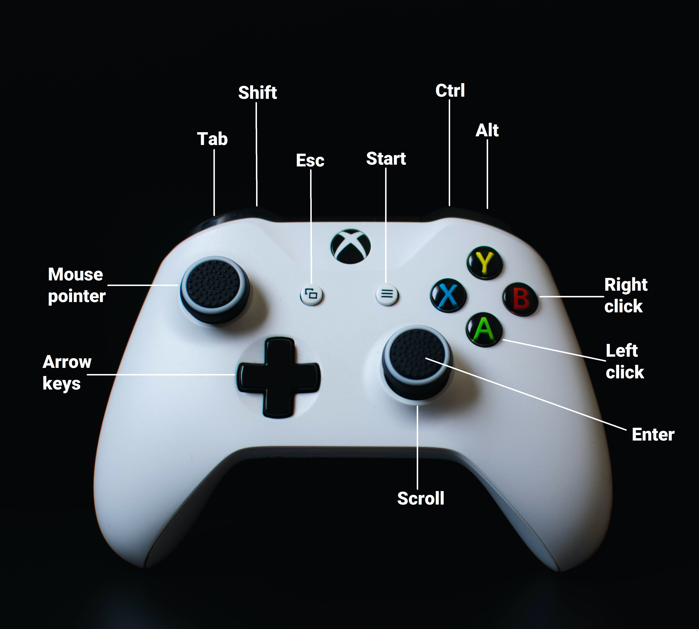

<h1 align="center"><strong>Araam</strong>
</h1>
<h1 align="center"></h1>
<h5 align="center"><strong>Control your PC with just a controller!</strong>
</h5>

<h5 align="center">

 

</h5>

 

_Araam_ (Kannada/Hindi) means 'comfort'. This software helps to use the computer with _araam_.

 

# :page_with_curl: Contents

1. [Description](#Description)
   1. What is it?
   2. What is the use of it?
   3. Working methodology
   4. History
2. [Installation](#Installation)
3. [Usage](#Usage)
4. [Screenshots](https://github.com/Karthikeshwar1/Araam#screenshots)
5. [Credits](https://github.com/Karthikeshwar1/Araam#credits)
6. [License](https://github.com/Karthikeshwar1/Araam#license)

 

# :sparkles: Description

## What is it?

- A software which makes a game controller performs the actions of both a keyboard and a mouse
- The softwares operates in 2 modes:
  - Keyboard mode
  - Mouse mode
- A new way of [Human-Computer-Interaction (HCI)](https://www.interaction-design.org/literature/topics/human-computer-interaction)

 

## What is the use of it?

- Makes it easier to control the computer using just the game controller
- There might be a learning curve to get familiar with the software, but after that, it becomes more comfortable to use than a keyboard and a mouse
- This software can also be used as an accessibility feature, especially for people with difficulty in using the keyboard and the mouse

 

## Working methodology

The Dpad buttons and the left shoulder button are used as [modifier keys](https://en.wikipedia.org/wiki/Modifier_key).
The keyboard layout is divided into 7 sections, each of them comprising of 4 keys. The modifier keys lets the user focus on one of these sections, and then X, Y, B, A buttons can be used to select a character. In each of the sections, X, Y, B, A buttons are mapped to the keys in a clockwise manner. Even the modifier buttons used for focusing on the sections are mapped in a similar way. This makes it easier and intuitive to remember the key combinations.

<h1 align="center"></h1>
 

<h1 align="center"></h1>

 

## History

- [Douglas Engelbart](https://en.wikipedia.org/wiki/Douglas_Engelbart), the inventor of the computer mouse, invented the first [chorded keyboard](https://www.artofchording.com/layout/chorded-keyboard.html) in 1968 at what is often called [The Mother Of All Demos](https://en.wikipedia.org/wiki/The_Mother_of_All_Demos).
- Today, there are many alternatives to using the conventional keyboard, like [keyer](https://en.wikipedia.org/wiki/Keyer) and [stenotype](https://en.wikipedia.org/wiki/Stenotype).
   
- Microsoft has designed and [patented](https://www.windowscentral.com/microsoft-has-patented-radial-keyboard-designed-xbox-joystick-typing) a radial keyboard for typing with the Xbox controller.

 

## :letter: Usage

- Press start and back simultaneously to switch between keyboard and mouse modes
- Hold down start and back buttons for a short period of time to exit the software

### Keyboard mode:

<h1 align="center"></h1>

### Mouse mode:

<h1 align="center"></h1>

 

## :seedling: Screenshots

<h1 align="center"></h1>

<h1 align="center"></h1>

 

# :hammer: Credits

Program is written in Python with the help of the following amazing tools:

- [PyQt5](https://riverbankcomputing.com/software/pyqt)
- [PyAutoGUI](https://pypi.org/project/PyAutoGUI/)
- [XInput-Python](https://pypi.org/project/XInput-Python/)

Keyboard photo by <a href='https://www.freepik.com/photos/background'>mrsiraphol - www.freepik.com</a>

App icon by <a href="https://www.freepik.com" title="Freepik">Freepik</a> from <a href="https://www.flaticon.com/" title="Flaticon">www.flaticon.com</a>

Xbox controller icons by Nicolae (Xelu) Berbece from [OpenGameArt.org](https://opengameart.org/content/free-keyboard-and-controllers-prompts-pack)

 

# :page_facing_up: License

 
